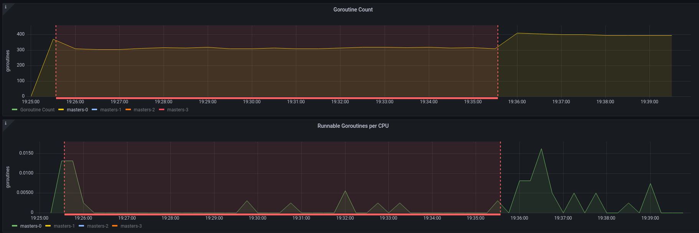
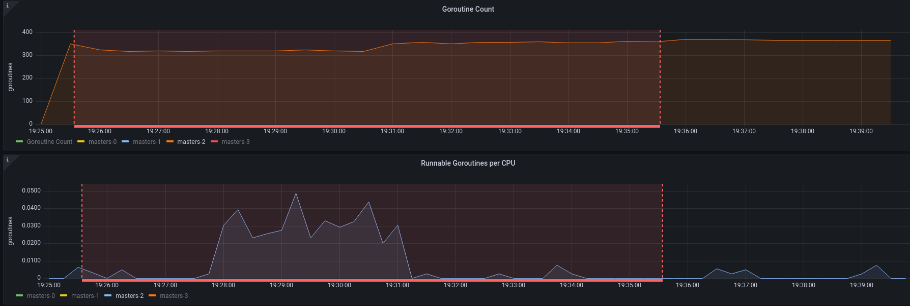
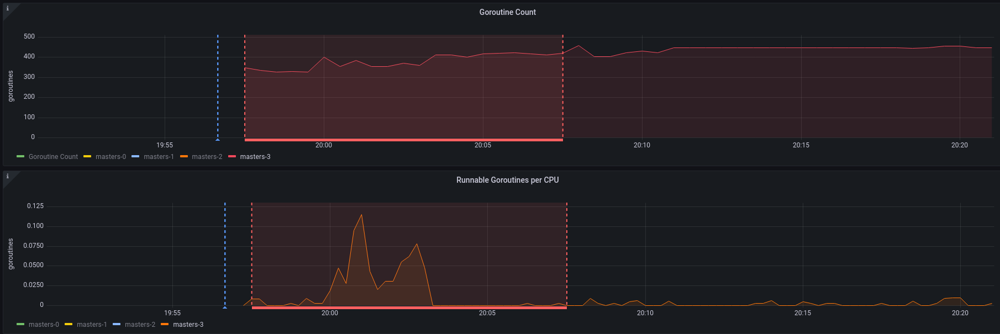

### 1. Baseline Single

1) Start a standalone Cockroach database server
2) Load the database with keys
3) Run a sequence of YCSB workloads in the following order (A,B, C,F, D, E)

#### Observations

* Nothing strange

### 2. Baseline Cluster Deterministic

1) Start a set of individual Cockroach servers
2) Combine the individual servers into a Cockroach cluster.
3) Run a sequence of YCSB workloads (A,B, C,F, D, E), sending traffic to masters-0

#### Observations

* If we run the load with 400 threads then the entire system blocks after 66.2K requests.
* This behavior is not reproducible on baseline-single.
* Beware not to include invalid server names on the inputs. The failure is not detected.

### 3. Baseline Cluster Deterministic-OutOfOrder

1) Start a set of individual Cockroach servers
2) Combine the individual servers into a Cockroach cluster.
3) Run a sequence of YCSB workloads (A,B, C,F, D, E), sending traffic to masters-2

#### Observations

* The experiment blocks after 65K requests.

### 4. Baseline Cluster Non-Deterministic

1) Start a set of individual Cockroach servers
2) Combine the individual servers into a Cockroach cluster.
3) Run a sequence of YCSB workloads (A,B, C,F, D, E), sending traffic to all servers.

#### Observations

* Deadlock, like in example 3.

### 5. Scale-up Scheduled

1) Start a set of individual Cockroach servers
2) Combine the individual servers into a Cockroach cluster.
3) Run workload A sending traffic to a random node
4) Scale-up the topology by periodically adding new nodes

#### Observations

* The experiment requires every service to set the "advertise host" equal to the pod's name.
* The experiment blocks arbitrarily -- sometimes at 387K keys, sometimes at 900K.

### 6. Scale-up Conditional

1) Start a set of individual Cockroach servers
2) Combine the individual servers into a Cockroach cluster.
3) Stress the topology by periodically adding new clients sending traffic to a random node
4) Scale-up the topology when the tail-latency goes above a given threshold

#### Observations

* In the current implementation, the more-servers cluster will keep creating database nodes for as long as the alert
remains active. Which means that if the performance does not recover (and acknowledged back to the controller) before
the next reconciliation cycle begins, the controller will keep creating nodes. Is this the desired behavior, or do we
need one new node per alert? Or do we need a creation interval within the same alert ?

* For the moment, you can implement this functionality using multiple clusters with logical dependencies between them.
In this case, you have group a, group b, group c, with each group depending the previous (to become Running), and
scheduled conditions with alerts.

### 7. Elastic Scale-down (Delete)

1) Start a set of individual Cockroach servers
2) Combine the individual servers into a Cockroach cluster.
3) Run workload A sending traffic to a random node
4) Scale-up the topology by adding 5 more services (group a).
5) Scale-up the topology by adding 5 more services (group b).
6) Scale-down the topology by **deleting** services in group a  (remove it from the Kubernetes API)

#### Observations

* Currently, deletion is supported only at the level of "Actions"/Jobs. You may delete a cluster, but not services
within a cluster.
* If the "Action" is of type Service, then you can delete it directly.

### 8. Elastic Scale-down (Stop)

1) Start a set of individual Cockroach servers
2) Combine the individual servers into a Cockroach cluster.
3) Run workload A sending traffic to a random node
4) Scale-up the topology by adding new nodes
5) Scale-down the topology by periodically **stopping** some nodes (run command within target container to drain the
node)

#### **Observations**

* With the present cockroach container it is difficult to terminate the cockroach process gracefully (lack of pidof,
pkill, or ps)

* The cockroach's native way is to drain the node, without stopping the process. Given that, the services appear as "
live" to Kubernetes, but without producing any data for Grafana.
* The experiment blocks randomly.

### 9. Elastic Scale-down (Kill)

1) Start a set of individual Cockroach servers
2) Combine the individual servers into a Cockroach cluster.
3) Run workload A sending traffic to a random node
4) Scale-up the topology by adding new nodes
5) Scale-down the topology by periodically **killing**  some nodes (use Chaos-Mesh to forcibly kill the container)

#### Observations

* We need to setup the "toleration" field in the Cluster. Otherwise, when a service fails, the cluster will immediately,
before the experiment's activities are done.

### TODO

#### Failure at hotspot

This experiment configures a cluster of 3 cockroach nodes and sends traffic to one of them.

After 2 minutes, we inject a failure on the most used server.

Observations

* Not currently supported. We must change the macros to select services based on Grafana information.

### 10. Bitrot

Replicate roachtest from
https://github.com/cockroachdb/cockroach/blob/master/pkg/cmd/roachtest/tests/sstable_corruption.go#L30

#### Observations

1. Xargs is missing. We need to add it manually

2. The import blocks unless all servers are started

1) The roachtest makes use of c.Start() and c.StartE().
2) But If I try to "init" the cluster twice I get an error message.

3. Some SSTs have peculiar names which cause dd to fail

> \xb4\xb6"/0/1651588517.218867146,0#31483,SET]
> Corrupt \xb4\xb6"/0/1651588517.218867146,0#31483,SET].sst

4. Cockroach detects and bitrot and panics with error

> * ERROR: [n3] a panic has occurred!
>
> \* panic: must not be holding latches
>
> \* (1) attached stack trace
>
> ...
>
> \* Wraps: (2) forced error mark
>
> * | "pebble: corruption"

### 11. Network

Replicate roachtest from
https://github.com/cockroachdb/cockroach/blob/release-21.2/pkg/cmd/roachtest/tests/network.go#L100

#### Baseline

***TO* network partition** (masters-0 -> masters-1, masters-2, masters-3)

| TCP  (from / to) | masters-0  | masters-1      | masters-2      |
| ---------------- | ---------- | -------------- | -------------- |
| masters-0        | **Yes**    | **No** (stall) | **No** (stall) |
| masters-1        | No (stall) | Yes            | Yes            |
| masters-2        | No (stall) | Yes            | Yes            |

| UDP  (from / to) | masters-0       | masters-1 | masters-2 |
| ---------------- | --------------- | --------- | --------- |
| masters-0        | **Yes**         | **YES**   | **Yes**   |
| masters-1        | No (**denied**) | Yes       | Yes       |
| masters-2        | No (**denied**) | Yes       | Yes       |

1. Localhost is always reachable for both public and localhost IPs.
2. Egress TCP from masters-0 is feasible, but the ACK is blocked from ingress rule, and the connection is stalled
3. Normally the connections are stalled. However, UDP from masters-1/2 to masters-0 fails with a "permissioned denied"
error.

***BOTH* network partition** (masters-0 -> masters-1, masters-2, masters-3)

| TCP  (from / to) | masters-0  | masters-1  | masters-2  |
| ---------------- | ---------- | ---------- | ---------- |
| masters-0        | Yes        | No (stall) | No (stall) |
| masters-1        | No (stall) | Yes        | Yes        |
| masters-2        | No (stall) | Yes        | Yes        |

| UDP  (from / to) | masters-0   | masters-1       | masters-2       |
| ---------------- | ----------- | --------------- | --------------- |
| masters-0        | **Yes**     | No (**denied**) | No (**denied**) |
| masters-1        | No (denied) | Yes             | Yes             |
| masters-2        | No (denied) | Yes             | Yes             |

1. Like before, with the exception that UDP traffic does not go through

#### Observations

##### 1. PGURL

There is an issue with the pgurl format. For the rest of the experiment we continue without it.

> [root@masters-2 cockroach]# ./cockroach workload run tpcc --init --warehouses=1 --duration=1m {pgurl:2-4}
> Error: parse "{pgurl:2-4}": first path segment in URL cannot contain colon

##### 2. Live node account

​ During the partition, the reported number of nodes is 0.

* If the partition starts after the workload, it recovers when the partition is repaired
* Otherwise, it remains 0

##### 3. System failure

**Sub-Scenario:** Connectivity when applying ***BOTH*** network partition **(workload -> sleep 3m -> partition)**

1. For 3 minutes prior to partition everything works normal
2. When the partition kicks-in the workload fails with the following messages

> workload/pgx_helpers.go:72  [-] 492 pgx logger [error]: Exec logParams=map[args:[] err:ERROR: result is ambiguous (
> error=rpc error: code
> = Unavailable desc = error reading from server: EOF [propagate]) (SQLSTATE 40003) sql:RELEASE SAVEPOINT
> cockroach_restart]\r\nI220518 19:21:15.045714 167 workload
> /pgx_helpers.go:72  [-] 493 pgx logger [error]: Query logParams=map[args:[0 3 272] err:ERROR: restart transaction:
> TransactionRetryWithProtoRefreshError: Transac
> tionAbortedError(ABORT_REASON_CLIENT_REJECT): \"sql txn\

##### 4. Scenario: Connectivity when applying ***TO*** network partition (workload -> sleep 3m -> partition)

Overall routines

Masters-0 (Isolated node)

Masters-3 (Workload node)

Masters-2 (Random replicated node)

##### 5. Scenario: Connectivity when applying ***BOTH*** network partition (partition -> sleep 3m -> workload)

Overall routines

Masters-0 (Isolated node)

Masters-3 (Workload node)

Masters-2 (Random replicated node)

##### 6. Scenario: Connectivity when applying ***TO*** network partition (partition -> sleep 3m -> workload)

Overall routines

Masters-0 (Isolated node)

Masters-3 (Workload node)

Masters-2 (Random replicated node)

