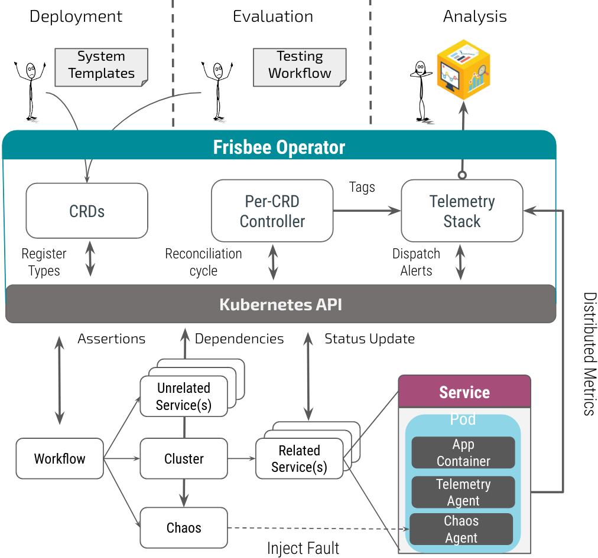

## Frisbee Overview

Frisbee is an open source cloud-native platform intended for engineers and researchers looking to explore, test, and benchmark  distributed applications faster and more reliably. It offers various types of fault simulation and has an enormous capability to orchestrate complex scenarios in the domains of:

- Cloud Databases
- Federated Learning Frameworks
- Telecommunication services
- Blockchain applications
- IoT applications

## Core Strengths

Unlike all prior tools, Frisbee delivers a fully automated testing environment. 

- Setup initial dependency stack – easily!
- Test against actual, close to production software - no mocks!
- Replay complex workloads written in an intuitive language!
- Combine Chaos Engineering with large-scale performance testing!
- Assert actual program behavior and side effects

## Architecture Overview

Frisbee is built on Kubernetes CRD (Custom Resource Definition).  To manage different experiments, Frisbee defines multiple CRD  types and implements separate controllers for different CRD objects. Frisbee primarily contains three  components:

- **Frisbee Dashboards**: The  visualization components of Frisbee. It offers a set of  user-friendly web interfaces through which users can manipulate and  observe the experiments. 
- **Frisbee Controller Manager**: The core logical component of Frisbee. Frisbee Controller Manager is  primarily responsible for the scheduling and management of Frisbee experiments. This component contains several CRD Controllers, such as  Workflow Controller, Cluster Controller, Chaos Controller, and Controllers of various action types.

