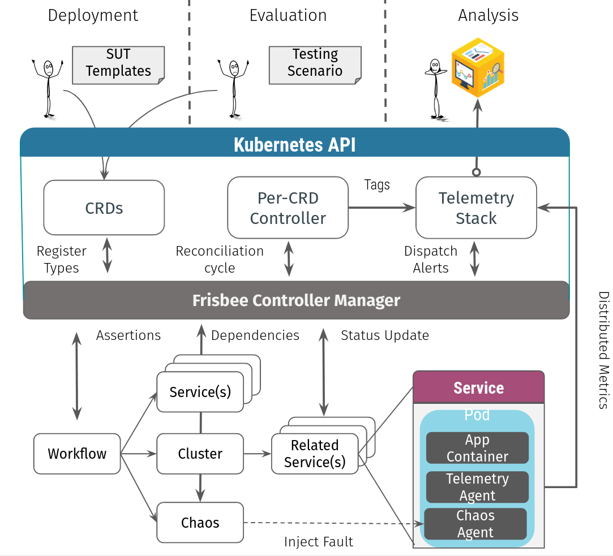

## Frisbee Overview

Frisbee is an open source cloud-native platform intended for engineers and researchers looking to explore, test, and benchmark  distributed applications faster and more reliably. It offers various types of fault simulation and has an enormous capability to orchestrate complex scenarios in the domains of:

- Cloud Databases
- Federated Learning Frameworks
- Telecommunication services
- Blockchain applications
- IoT applications

Frisbee is implemented as a Kubernetes CRD (Custom Resource Definition). As a result, Frisbee workflows can be managed using `kubectl` and natively integrates with other Kubernetes services such as volumes, secrets, and RBAC. The new Frisbee software is light-weight and installs in under a minute, and provides complete workflow features including parameter substitution, fixtures, loops and recursive workflows.

Dozens of examples are available in the [examples directory](https://github.com/CARV-ICS-FORTH/frisbee/tree/main/examples) on GitHub.

For a complete description of the Frisbee workflow spec, please refer to [the spec documentation](https://frisbee.dev/user-guide/fields/#workflowspec).

Progress through these examples in sequence to learn all the basics.

## Core Strengths

Unlike all prior tools, Frisbee delivers a fully automated testing environment. 

- Setup initial dependency stack – easily!
- Test against actual, close to production software - no mocks!
- Replay complex workloads written in an intuitive language!
- Combine Chaos Engineering with large-scale performance testing!
- Assert actual program behavior and side effects

## Architecture Overview

Frisbee is built on the [Kubernetes operator pattern](https://kubernetes.io/docs/concepts/extend-kubernetes/operator/). To manage different experiments, Frisbee defines multiple Custom Resource Definition (CRD)  types and implements separate controllers for different CRD objects. As shown in the image below, the overall architecture of Frisbee can be divided into three parts from top to bottom:

- **User Input and Observation**:  Frisbee offers a set of  user-friendly web interfaces through which users can manipulate and  observe the experiments. Users do not directly interact  with the Frisbee Controller Manager. User input reaches the Kubernetes API Server  starting with a user operation (Action), which is eventually  reflected as a resource change managed by the Frisbee Controller Manager (such as the change of Service resource). Actions describe the changes of a certain Frisbee resource, such as a new Workflow object or the  creation of a Frisbee object.

- **Frisbee Controller Manager**: The core logical component of Frisbee responsible for  the scheduling and management of Frisbee experiments. The Frisbee Controller Manager only accepts  events from the Kubernetes API Server.  This component contains several CRD Controllers, such as  Workflow Controller, Cluster Controller, Chaos Controller, and Controllers of various action types. A CRD defines a new, unique object Kind in the Kubernetes API, listing out all of the configurations for describing the desired state of that object. A controller is a software loop that watches the Kubernetes API for changes, and if necessary, takes actions to reconcile the expressed desired state and the current state of an object.

- **Kubernetes resources:** The Frisbee Controller Manager is primarily responsible for the translation of top-level Actions to the low-level Kubernetes resources. 

##### 

**Contextualized Visualizations:** Particular emphasis is given to easy-to-understand reporting as it is as important as the tests themselves. Testing models may be built upon highly complex scenarios, and because of the automation architecture, the individual results may need to be provided with additional interpretation and contextual data. To do so, when creating or deleting an object, the controller pushes a descriptive annotation to Grafana, providing the context to visually correlate the observed behavior with a root event. For instance, an annotation marking the injection of a network fault could help in explaining an otherwise enigmatic drop in the system's throughput. 
