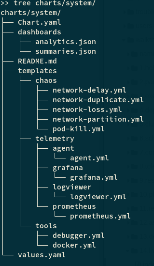

## Create Custom Visualizations


#### Package Structure

If you go to `charts/system` you will see the following structure.




The `dashboards` directory,  containers the default (or custom) `Grafana Dashboards`.

The templates, provide the templates for the `Telemetry Agents` as well as for the  `Grafana and Prometheus Services`. The `Chaos` and `tools` templates are describe common fault-injection and debugging tools that can be used out-of-the-box.


#### Add Custom Telemetry Agent

To understand how to integrate a new telemetry agent, let's use a simplified version of the the `systems.telemetry.agent` found in `charts/system/`.


```yaml
apiVersion: frisbee.dev/v1alpha1
kind: Template
metadata:
  name: system.telemetry.agent
spec:
  service:
    containers:
      - name: cadvisor
        image: gcr.io/cadvisor/cadvisor:v0.44.0
        ports:
          - name: tel-sys	# Prometheus-scanned
            containerPort: 9442
        command:
          - /bin/sh 
          - -c 
          - |  
			...
			# The telemetry agent
            cadvisor --port=9442  ... 
```


* **Ports:** are filtered by Prometheus.  They should be `prefixed` with `tel-`. Otherwise they are ignored
* **Agent**: the binary responsive for collecting metrics and expose them to Prometheus.


#### Bind Agent With Dashboard


For the Visualization to be effective, the `Dashboard` should be able to understand and correctly parse the metrics collected by the `Agent`. However, because the `Agents` and the `Dashboards` are independent components, more frequently than you wish, you will find yourself tuning the output of the `Agents` and the input of the `Dashboard`. With Frisbee, we save ourselves by simply correlating the `Dashboards` to the specified `Agents`.

```yaml
---
apiVersion: v1
kind: ConfigMap
metadata:
  name: system.telemetry.agent.config
data: {{(.Files.Glob "dashboards/*.json").AsConfig | nindent 2}}
```


> **NOTE:** We know that a dashboard belongs to an agent if it follows the pattern `{{agentName}}.config`. For example, `system.telemetry.agent.config`.

